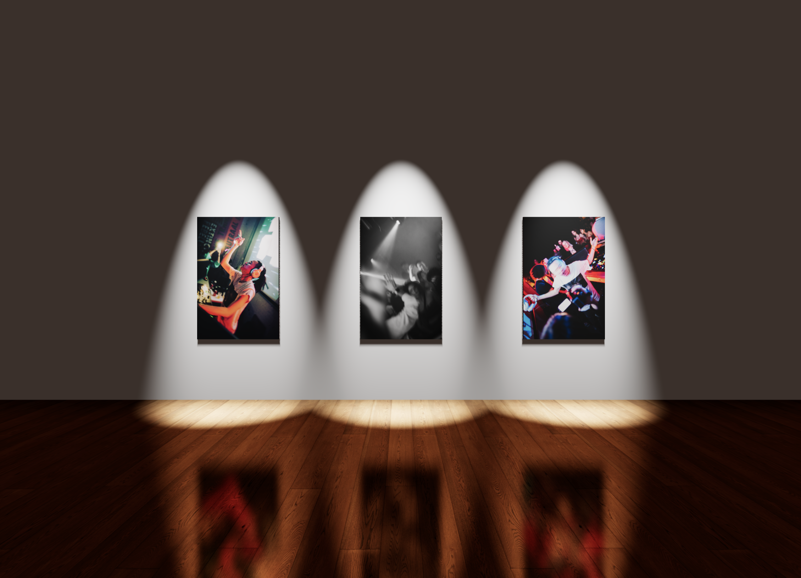

# YourExhibition

⚠️ This project is currently an early prototype! ⚠️

A personal project aimed to present a virtual exhibition for my photographic works, developed using the following libraries and framework:

- Next.js (React/TypeScript)
- @react-three/fibre
- @react-three/drei
- @react-three/rapier

# Accessing the latest version

The main branch of this project is deployed on Vercel, and can be acessed at  [🔗 YourExhibition](https://your-exhibition.vercel.app).

# Screenshot

# Milestones

### Achieved 

✅ First-person controls + WASD movement  
✅ Basic physics configuration for player  
✅ Init global light configuration and spotlight setup

### TODOs

🔴 Instructions overlay  
🔴 Spotlight Model  
🔴 Player Model  
🔴 Provide photo title and caption upon hover on  
🔴 Extensive exhibition layout  

### Future Considerations

⚫️ UI to allow user to select the different exhibition available  
⚫️ Move photo assets to a bucket storage and photo meta-data sanitization  
⚫️ Admin dashboard to modify photos to be applied on preset canvases  
⚫️ Admin dashboard to modify canvas placements

# Disclaimer

All photographs used in this project are properties of © 2023, Kaijen Lee. 

You may view my photography portfolio at [🔗 Kaijen Lee](https://kaijenlee.com).
